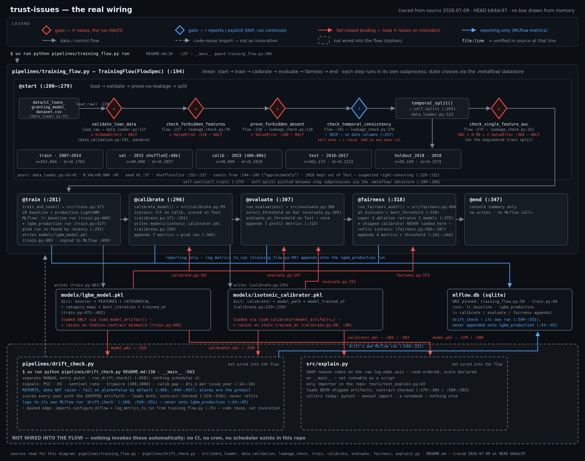
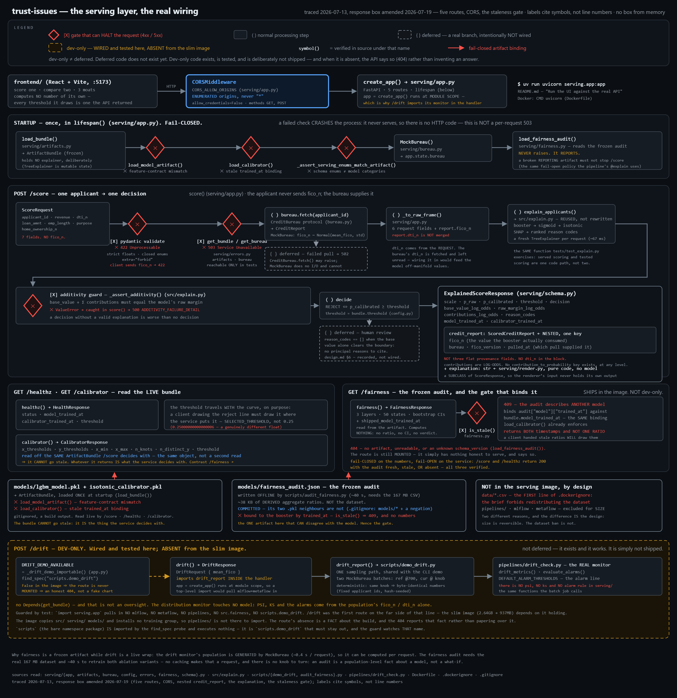

# trust-issues


<sub>Code is licensed under **MIT** (see [`LICENSE`](LICENSE)). The *dataset* is CC BY 4.0 — see [`data/README.md`](data/README.md).</sub>

**A loan risk model that did the boring parts right.**

> **Don't trust a number until you've tried to break it.**

Most loan-risk models fail quietly — in ways that never show up in a headline AUC. A target
hand-built from twenty loan-status categories. Post-decision fields like `recoveries` leaking the
future into features. A random split that lets the model peek ahead. An uncalibrated score no one
could price a loan with. Some of those mistakes make the score *look better*. This project has
trust issues with every one of them.

So it optimizes for the opposite of a leaderboard: a low, **honest** AUC over a high, contaminated
one. It takes the target from the data's own label, audits for leakage, splits by time, calibrates
its probabilities, and tries to break each fairness finding before believing it.

Run the whole chain — load, validate, train, calibrate, evaluate, fairness-audit — with a single
command:

```bash
uv run python pipelines/training_flow.py run
```

The headline number is a test AUC around **0.67** — and that's the point, not the apology. With
eight application-time features and no credit-bureau history, that is the ceiling. **A 0.67 you can
trust beats a 0.99 you can't.**



*[Interactive version](docs/architecture.html) — every label cites the symbol (function, constant,
or step) it was verified under; the page's Export-as-PNG button regenerates the image above.*

Colour carries meaning and nothing else: red is a gate that raises and halts the run, blue is
reporting that can halt nothing, grey dashed is code not wired into the flow.
`pipelines/drift_check.py` sits outside the pipeline — a separate manual entry point — and is drawn
that way rather than connected. (`src/explain.py` was an orphan here too; the `explain` step now
wires it in as a blue reporting node after fairness, and the image above — re-traced 2026-07-11
after the Phase 2 `train.py`→`model_io.py` split — draws it in the flow.) No calibrator edge runs to the fairness step —
`run_fairness_audit()` never loads the shipped calibrator, it refits its own isotonic inside that
same function — so drawing that edge would be a lie.

---

## What this project does right

| Stage | What |
|-------|------|
| **1. Problem framing** | Binary default target taken from the dataset's own label (fully paid vs. defaulted) — no invented horizon; the cost-sensitive operating threshold is set later, in evaluation (LGD 0.65 / margin 0.12), not assumed upfront |
| **2. Leakage-aware data prep** | A pandera schema gate plus four leakage sentinels wired into the pipeline: two blocklist checks that raise (forbidden post-decision fields in the feature list / reintroduced into the frame), a standalone-AUC gate (any single feature with AUC > 0.9 fails the run), and a temporal-consistency sentinel that self-arms if a date column ever appears — on today's cleaned data it logs an explicit SKIP with its reason, rather than pretending to guard |
| **3. Point-in-time-safe features** | All features constructed from data available at application date only |
| **4. Baseline-first modeling** | Logistic-regression baseline before LightGBM; no premature complexity |
| **5. Calibration + cost-based thresholds** | Isotonic calibration on a disjoint calibration slice; operating threshold chosen by expected profit, not 0.5 |
| **6. Explainability + fairness** | SHAP reason codes in `src/explain.py` — rank-ordered risk-increasing factors on the model's raw **log-odds** axis, never converted to probability contributions (that quantity is undefined here — see "What this isn't"); a hand-rolled three-layer fairness audit — bootstrap CIs on the Equal-Opportunity ratio, a threshold sweep, and an ablation that retrains without `addr_state`. The audit caught `addr_state` acting as a digital-redlining shortcut, so the production model drops it: Mississippi's EO ratio recovers **0.745 → 0.988 with non-overlapping 95% CIs**, for an AUC cost of 0.0036. Served, not just written down — `GET /fairness`, bound to the model it audited |
| **7. Drift monitoring** | A runnable yearly drift check (`pipelines/drift_check.py`): hand-rolled PSI + KS on `dti_n` per issue year against the training-years distribution, a separate 999-sentinel rate, a (100, 1000] tripwire share, and a per-year calibration gap scored with the shipped model. Validated against the dataset's own 2016+ DTI regime shift — the tripwire fires across all of 2016–2018, while the calibration-gap alarm fires on 2016–2017 (2018's gap flips slightly positive, +0.0154, staying under the alarm line); both are quiet on the 2015 baseline. The same monitor is drivable live through `POST /drift`, with a **negative control that does not move** (`dti_n`, Δ = 0.0000). A demonstrated capability on this dataset, not a live production monitoring service |

---

## Why most loan-risk projects fail

1. **Target leakage** — using fields like `int_rate`, `grade`, or `loan_status` that are
   set *after* the credit decision, not before.
2. **Random splits** — shuffling time-series data inflates AUC by letting the model peek
   at future patterns; always split by origination date.
3. **Inflated AUC as a red flag** — a single feature AUC > 0.90 almost always means
   leakage, not signal. Investigate before celebrating.

---

## What the paranoia actually caught

The discipline above isn't decoration — the audits fire on real data. Two cases where being
suspicious paid off:

**`addr_state` was a digital-redlining shortcut, so production dropped it.** The three-layer
fairness audit ends in an ablation that retrains the model *with* and *without* the state feature.
With `addr_state` in, Mississippi's Equal-Opportunity ratio for good borrowers sat at **0.745,
95% CI [0.716, 0.774]** — the *entire* interval under the 0.80 benchmark. Retrain without it and
it recovers to **0.988, CI [0.962, 1.012]**, at a test-AUC cost of just **0.0036** (0.6690 →
0.6654). The two intervals don't overlap, and MS is the only state confirmed with the label in —
zero once it's out. That the shift survives a bootstrap is the claim; two bare point estimates
couldn't tell it apart from sampling noise, which is precisely what Layer 1 exists to refuse. The
state label wasn't encoding Mississippi's economics; it was a geographic proxy the model leaned on
as a shortcut. The shipped model omits it, and `GET /fairness` serves the evidence.
(This is a redlining-*risk* analysis through geography, not a legal disparate-impact finding — see
[What this isn't](#what-this-isnt).)

**495 "impossible" DTI rows weren't dirty data.** The pandera schema gate flagged 495 rows with a
debt-to-income ratio between 100.04 and 991.57 — outside the valid 0–100 band and not the `999`
missing-value sentinel. The lazy fix is to delete them. Instead the anomaly got investigated, and
the evidence pointed the other way: those rows default at **27%** vs. 20% overall (so they aren't a
decimal-shift artifact — the "corrected" values would be the *safest* borrowers, not the riskiest);
they show up as a temporal cliff (0 such rows before 2015, 488 in 2016–2018); and they profile as
real high-income, high-loan-amount borrowers. Verdict: a genuine subpopulation surfaced by a
**2016+ change in how DTI was reported**, not garbage — so the contract was widened deliberately
(100 → 1000), not silently, and the episode flagged a live distribution shift the training years
never see. Full write-up in [`docs/data-decisions.md`](docs/data-decisions.md).

---

## Watch it work

The audits above are not screenshots in a write-up — there is a **live React frontend** talking to
the **real FastAPI service**, and none of its numbers are computed in the browser. Fill in the form,
and the decision that comes back is the shipped booster's, composed with the shipped calibrator, at
the threshold the pipeline actually chose. The explanation is checkable on the page: the reason
codes sum, with the base value, to the model's own raw margin — the service returns a **500 rather
than a decision** if they don't (`src/explain.py`'s `_assert_additivity`).

The frontend exists to make the existing rigor *visible*. It does not change a single number.

Three of its views are there because each one is hard to fake:

**Calibration — the step function you can see.** `GET /calibrator` returns the shipped isotonic
calibrator's own knots, and the UI draws them. You can watch the score land on one of **52 distinct
levels** and see the slope sit at exactly zero across most of the reject region. That picture *is*
the argument for why this repo refuses to publish "this feature added N points of default
probability": under a step function, the quantity has no value to compute
([`docs/explainability.md`](docs/explainability.md) §4–§5). The chart is read off the live artifact,
so a retrain changes it — a baked-in snapshot would break exactly the claim it makes.

**Monitoring — a knob, and a negative control that refuses to move.** `POST /drift` turns
`MockBureau`'s `mean_fico` and hands the shifted population to the *real* monitor
(`pipelines/drift_check.py` — the same PSI/KS/alarm code the batch job runs; the endpoint
re-implements none of it). Drag the market's mean FICO from 700 down to 650 and `fico_n`'s PSI goes
**0.0092 → 0.9873** and alarms. The point is what happens beside it: `dti_n` — which the knob does
not touch — holds **PSI 0.0052 and KS 0.0240 at *both* settings, Δ = 0.0000**. Catching drift is
easy if you alarm on everything. The control is what proves the monitor fires on *real* drift and
not on any change at all.

**Fairness — the finding, served as evidence rather than as prose.** `GET /fairness` serves the
three-layer audit. Layer 1 on the shipped model is a wall of green (50 states, 0 confirmed) and the
page says so *and* says why that proves almost nothing — at that threshold the model approves 82.4%
of good applicants, and a permissive cutoff washes state differences out. The finding lives in
Layer 3's counterfactual, with a bootstrap interval on both sides (see below).

---

## What this isn't

Listing your own limits is part of the same discipline: a model you can trust is one whose author
already knows where it breaks. This is a **case study in modeling judgment**, not a production
credit system.

- **Originated-loan model, not full underwriting.** The data contains only loans LendingClub
  approved; rejected applicants have no observed outcome. Deploying this as a granting model would
  require reject inference.
- **Feature-limited ceiling.** AUC ~0.67 reflects the absence of credit-bureau data (utilization,
  delinquency history, inquiries) — a data limit, not a modeling failure.
- **Stylized economics.** The profit model uses fixed LGD (0.65) and margin (0.12) assumptions.
  Real P&L needs term structure, pricing, servicing costs, and capital charges.
- **Fairness audit uses geography as a proxy.** Without protected-class labels, it audits redlining
  risk through `addr_state` — not a legal disparate-impact determination.
- **SHAP contributions live on the raw log-odds axis, and cannot be moved off it.**
  `src/explain.py` ships rank-ordered reason codes, not percentage-point attributions.
  That is not a mapping left undone — the mapping does not exist. The shipped isotonic
  calibrator is a 52-level step function whose slope is exactly zero across 99.31% of the
  reject region, so "this feature added N points of default probability" has no value to
  compute ([`docs/explainability.md`](docs/explainability.md), §4–§5). What survives both
  the sigmoid and the isotonic step is the **sign and the rank** of each contribution, and
  that is all this module reports. Whether a notice built on rank order alone satisfies
  ECOA / Regulation B is a question for counsel — we are not lawyers.

---

## Serving layer



*[Interactive version](docs/architecture-serving.html) — same convention as the training diagram:
every label cites the symbol it was verified under, and the page's Export-as-PNG button regenerates
the image above.*

*Read this one differently from the diagram above: it traces HTTP requests through the five routes,
not a pipeline run. Its legend adds bracket notation — `[X]` a gate that can halt, `( )` a normal
step, `{ }` a **deferred** branch — and one marker the training diagram has no need for: **dev-only**,
for code that is wired and tested here and deliberately absent from the slim image. Dev-only is not
deferred, and the diagram keeps them apart: deferred code does not exist yet; dev-only code exists,
works, and simply is not shipped — and when it isn't there, the API says so rather than inventing an
answer.*

`[X]` is a gate that can halt the request: 422 on invalid input (closed enums, strict floats,
`extra="forbid"`), 500 when the additivity guard fails (`src/explain.py`'s `_assert_additivity`,
wrapped by `serving/app.py`'s `/score` handler), and 503 when the model bundle or the bureau is
missing from the running app — reachable only in tests, since production loads both at startup or
the process never serves at all (`serving/errors.py`'s module docstring, its "503" section). The
startup contract checks — feature contract, calibrator binding, category-enum consistency
(`serving/artifacts.py`'s `load_bundle()`) — are a separate, one-time gate inside `lifespan`: if any
of them fail, the process crashes before it accepts a single request, which is not the same thing as
a per-request 503. `{ }` marks two branches that are real but deliberately unwired: a failed bureau
pull (`CreditBureau.fetch()`'s contract permits raising it; `/score` calls it unguarded because the
only implementation today, `MockBureau`, performs no I/O and cannot fail — `docs/data-decisions.md`
records a 502 error class as the first thing to add once a real bureau is wired in) and routing a
decision with an empty `reason_codes` list to human review (`docs/design.md` §6) — both recorded,
neither implemented.

`serving/` is a FastAPI adapter over the trained model + calibrator. It reuses `src/`'s logic
rather than re-implementing it — `/score` calls `explain_applicants()` directly, from
`serving/app.py`'s `/score` handler, the same function `tests/test_explain.py` exercises, so
production scoring and tested scoring run through one code path, not two.

Five routes, and **two of them are absent from the production image on purpose**:

| Route | What it does | In the slim image? |
|---|---|---|
| `POST /score` | Scores one applicant into a decision plus rank-ordered reason codes, with the credit pull it was decided on | yes |
| `GET /healthz` | Readiness, and the identity of what's loaded (`model_trained_at`, `calibrator_trained_at`, threshold) | yes |
| `GET /calibrator` | The shipped isotonic calibrator's own knots and the real decision threshold, read off the bundle `/score` decides with | yes |
| `POST /drift` | Turns `MockBureau`'s `mean_fico` and returns the **real** monitor's PSI/KS/alarms | **no — dev only** |
| `GET /fairness` | The frozen three-layer fairness audit, bound to the shipped model | yes, when the artifact ships |

The two exclusions have *different* reasons, and the difference is the whole design:

- **`/drift` is dev-only for dependency and size reasons.** The monitor lives in `pipelines/`, which
  the slim image does not copy and whose `mlflow` / `metaflow` dependencies it does not install
  (`uv sync --no-group training`). The route is mounted behind a `find_spec` probe
  (`serving/app.py`'s `DRIFT_DEMO_AVAILABLE`) and the handler imports the monitor *inside* the
  function — importing it at module scope would **kill the container at boot**, on `import
  serving.app`, before a single request (`serving/app.py:70` says it exactly). It would not make
  the image bigger: `pipelines/` is not in the image to import and `mlflow` is not installed, so
  the container is still 937MB — it just does not run. **The graph decides whether skipping the
  training group is safe; `uv sync --no-group training` decides the size.** In the container the
  route is simply not there, and a client gets an **honest 404**. A test asserts the line holds:
  `import serving.app` pulls in no `mlflow`, no `metaflow`, no `pipelines`, no `src.fairness`.
  The route's absence in the image was itself an assertion until 2026-07-17, when the image was
  built once by hand and answered: `DRIFT_DEMO_AVAILABLE` is `False` in the container. That does
  **not** make it guarded — no test reads the `Dockerfile`, and `88a8403` cut this very clause out
  of a test's name for that reason. One hand-built image, one date, nothing re-checking it.
- **`/fairness` is a frozen artifact because the data may not ship.** `run_fairness_audit()` needs
  the 167 MB assessment CSV — the *first line* of `.dockerignore`, because the brief forbids
  redistributing it — and ~40 s to retrain both ablation variants. That is not a size trade-off we
  could reverse; it is a constraint on what may be shipped at all. So the audit runs **offline**
  (`scripts/audit_fairness.py`) and freezes its *output* — derived aggregate ratios, not the dataset.

Both refusals obey one rule: **an honest 404 or 409 beats a fabricated chart.** A route that isn't
there says so; it does not invent a plausible curve.

**`GET /fairness` serves the audit — and refuses to, when it's about a different model.**
`scripts/audit_fairness.py` runs the real `run_fairness_audit()` offline and freezes **~38 KB of
derived ratios** — 50 Equal-Opportunity ratios with bootstrap CIs, the threshold sweep, the
ablation — into `models/fairness_audit.json`, which is **committed** (the two `.pkl` files beside
it are not; see `.gitignore`). It has to be: `models/` and `data/*.csv` are *both* gitignored, so a
fresh clone can neither serve the model nor regenerate the audit. As a build artifact, the evidence
behind this repo's loudest fairness claim would exist only on whichever machine last ran it.

That artifact is the one thing in this service that **can go stale**: retrain, and the JSON would
still cheerfully report Mississippi at 0.7448, about a booster that no longer exists. `/calibrator`
has no such problem — it reads the live bundle, so whatever it returns *is* what `/score` decides
with. So the audit is **bound to the model by `trained_at`** — the same binding `load_calibrator()`
already enforces between the calibrator and the booster — and on mismatch `/fairness` returns **409
with both timestamps and not one ratio**.

Withholding the numbers is the point, not an inconvenience: a client handed stale ratios with a
warning attached will draw the ratios, and a reader remembers the chart, not the caveat.
**Fail-closed on the numbers, fail-open on the service** — a broken *reporting* artifact never
stops `/score` (the audit is blue in the diagram: it reports, it gates nothing).

As of Phase 1, `fico_n` is no longer self-reported by the applicant. `POST /score` takes an
`applicant_id` instead, and the service fetches `fico_n` from a `CreditBureau` — a
one-method protocol, `fetch(applicant_id) -> CreditReport` (`serving/bureau.py`), so a real
bureau client can be swapped in later without touching `/score`. The only implementation
wired in today is `MockBureau`: deterministic — the same `applicant_id` always returns a
byte-identical report, performing no I/O to do it (its own docstring) — with
`fico_n` drawn from a `Normal(mean_fico, std_fico)` distribution seeded by the applicant ID
(`MockBureau.__init__`/`fetch`). `mean_fico` defaults to 700 and is a constructor argument,
not a constant: `MockBureau(mean_fico=650)` shifts the entire output distribution, a
deliberate knob for demonstrating a population-level credit-quality drift without touching
a real bureau record.

Every score response carries the pull it was decided on, under a single nested
`credit_report` key (`serving/schema.py`'s `ScoredCreditReport`): the **fetched `fico_n`
itself** — the credit value the booster actually consumed — together with the `bureau`,
`fico_version` and `pulled_at` that identify which pull supplied it. This is the same "a
decision must be able to identify the data it came from" principle already behind the
`model_trained_at` / `calibrator_trained_at` fields, carried one step further: a client is
told not only *which* report was pulled but *what was in it*, so the decision can be
checked against the data the decision used.

The pulled `dti_n` is deliberately **not** in that block, even though `CreditReport` has
one. `_to_raw_frame()` takes `dti_n` from the request and never reads `report.dti_n`, so
showing the bureau's value beside the decision would display a number the decision did not
use — under `MockBureau` those differ wildly (see `docs/data-decisions.md`). A block
labelled "credit report" carries the credit data the model consumed, and nothing it did
not.

Honestly: `MockBureau` is, by its own docstring, "a `CreditBureau` that never calls a real
vendor" — no real bureau is integrated. And **`serving/` still is not deployed**: it answers
requests in-process, under Docker, and to the frontend on `localhost`, but nothing runs it as a
live service — no host, no orchestration ([`docs/design.md`](docs/design.md) §4). The frontend is a
real client of a real API; both of them run on your machine. CORS reflects that honestly, too —
`CORS_ALLOW_ORIGINS` enumerates the two Vite dev origins and is deliberately **not** `"*"`, because
a wildcard costs nothing today and becomes a real hole the moment a credential is added, and nobody
re-reads a middleware argument that has always been there. A failed bureau pull is a known,
deliberately deferred gap — `CreditBureau.fetch()`'s contract permits raising, but `/score`
doesn't yet catch it, because `MockBureau` performs no I/O and cannot fail
(`serving/errors.py`'s module docstring, its "500" section; full record in
[`docs/data-decisions.md`](docs/data-decisions.md)). And the "no credit-bureau history"
phrasing above and in "What this isn't" is about the *model's* feature set — eight
application-time features, none of them utilization, delinquency, or inquiry history — not
about whether serving has any bureau data path at all; it now does, just not one feeding
new model features yet.

**Phase 2 decoupled serving from MLflow.** `src/train.py` split into `src/train.py` (MLflow
experiment-tracking orchestration; `train_and_save()` only) and `src/model_io.py` (the
encoding helpers, the LightGBM training loop, and `load_model_artifact()` — everything
`calibrate.py` / `evaluate.py` / `fairness.py` / `explain.py` / `serving/` /
`pipelines/drift_check.py` actually import). `serving/`'s import graph now bottoms out at
`model_io.py` and never reaches `mlflow` — confirmed at runtime (`mlflow` and `src.train`
are absent from `sys.modules` after importing `serving.app`), not just by grep.
`pyproject.toml` groups `mlflow` / `metaflow` / `matplotlib` / `seaborn` into a `training`
dependency group the Docker build excludes (`uv sync --no-dev --no-group training`); the
serving image measured **2.64GB → 937MB**. This changes what ships in the image, not
whether anything is deployed — see the paragraph above.

Three of those four packages are genuinely unreachable from serving. `matplotlib` is not,
and the same runtime check is what caught it: `mlflow`, `metaflow` and `seaborn` are absent
from `sys.modules` after `import serving.app` **in this repo**, but `matplotlib` is
*present* — `serving/` imports `lightgbm`, and LightGBM's compat module imports
`matplotlib` on the way in. Excluding it from the image is still correct, because LightGBM
wraps that import in `try` / `except ImportError` and degrades to no-plotting rather than
failing. So the honest statement is that serving **tolerates** `matplotlib`'s absence, not
that it never reaches it. The image is unchanged by this; only the sentence describing it
is. Writing "never reaches any of the four" would have been the same class of
untrue-but-flattering claim this project exists to catch, so it is written the long way
instead.

That was measured **here**, where the `training` group is installed. The other half — the
half that makes "tolerates" mean anything — was measured **there**, on 2026-07-17, by
building the image and asking from inside it:

```
matplotlib in sys.modules              False    # it is True in this repo
matplotlib installed at all            False
lightgbm.compat.MATPLOTLIB_INSTALLED   False
import serving.app                     OK       # the container does not die at boot
image size                             936MB
```

`True` here and `False` there is not a contradiction — it is the reason the exclusion is
safe. Reached in this repo, genuinely absent in the image. And `MATPLOTLIB_INSTALLED ==
False` inside the shipped container is LightGBM's `try` / `except ImportError` **firing**,
not us predicting that it would: the degradation this paragraph has always asserted is the
one the container actually performs. `tests/test_serving.py`'s `_TOLERATED` is the first
place that tolerance executes rather than narrates, and this is the measurement that makes
it more than an assertion about somebody else's code.

Read that as narrowly as it is written. **One image, one session, one manual `docker
build`, on one date.** There is no CI in this repo. Nothing rebuilds the image on a
schedule, nothing re-checks these five numbers, and **nothing will go red when one of them
stops being true.** A measurement is not a guard, and a dated measurement described as
though it were coverage is the failure this file's neighbours were written to catch. The
936MB is that build; the **937MB** above is a different build, from Phase 2. Both were
measured, nothing has reconciled them, and this sentence does not guess which is now right.

---

## Tech stack

| Tool | Role in this project |
|------|----------------------|
| **Python 3.11 + uv** | Runtime and reproducible dependency / virtualenv management |
| **LightGBM** | The production model — gradient-boosted trees on application-time features |
| **scikit-learn** | Logistic-regression baseline, preprocessing, and the isotonic calibrator |
| **SciPy** | Two-sample KS statistic in the drift monitor — declared as a direct dependency the moment code imported it directly. Evidently was deliberately not adopted: its web-server + telemetry dependency footprint isn't worth four scalar distribution signals, and hand-rolled PSI matches the repo's hand-rolled audits |
| **Pandera** | Schema gate that *fails* the pipeline on contract violations (it caught the 495 DTI rows) |
| **MLflow** (SQLite backend) | Experiment tracking; the pipeline logs every stage's metrics into one run. Training-only as of Phase 2 — `serving/`'s import graph does not reach it (see "Serving layer" above) |
| **Metaflow** | Orchestrates the end-to-end flow (load → … → fairness) as a linear `FlowSpec` |
| **SHAP** | `TreeExplainer` on the shipped booster, wrapped by `src/explain.py`: rank-ordered adverse-action reason codes whose contributions are the raw **log-odds margin**, declared as such in a `scale` field and in every key name. No probability-scale attribution is produced — see [`docs/explainability.md`](docs/explainability.md) §5. Called by `src/` and its tests, and wired into the Metaflow pipeline: the `explain` step logs global SHAP importance (mean absolute SHAP, log-odds) onto the `lgbm_production` run |
| **FastAPI + Pydantic** | The HTTP boundary (`serving/`). Pydantic is the *request contract*, not decoration: closed enums, strict floats (`"700"` is a 422, not a coerced 700), and `extra="forbid"` — a client that submits its own `fico_n` is rejected, because a client that could set its own FICO could describe an applicant whose score never came from a bureau pull |
| **React + TypeScript + Vite + Tailwind** | The frontend (`frontend/`). Talks to the live API and computes none of its own numbers — the model, the calibrator, the threshold, the drift monitor and the fairness audit are all read off the service. No charting library: the calibrator step function, the drift bars and the bootstrap intervals are hand-drawn SVG/CSS, so nothing is smoothed or interpolated into a curve the data doesn't have |
| **pytest** | 339 tests across the modeling and serving layers (101 of them in `tests/test_serving.py`) |

---

## Setup

```bash
uv sync                                              # install dependencies
uv run pytest                                        # run the test suite (339 passing)
uv run python pipelines/training_flow.py run         # end-to-end training pipeline
uv run python pipelines/drift_check.py               # yearly input-drift check on dti_n
uv run python scripts/audit_fairness.py              # re-run the fairness audit -> models/fairness_audit.json
mlflow ui --backend-store-uri sqlite:///mlflow.db    # browse experiment tracking
uv run jupyter lab                                   # open the analysis notebook
```

### Run the UI against the real API

Two terminals. The frontend is a client of the service, not a mock of it.

```bash
# terminal 1 — the API
uv run uvicorn serving.app:app --reload              # http://localhost:8000

# terminal 2 — the UI
cd frontend && npm install && npm run dev            # http://localhost:5173
```

`/score`, `/calibrator` and `/fairness` need `models/` populated — run the training pipeline first,
or the service refuses to start (it fails at boot rather than 500ing on the first applicant).
`/drift` needs the training dependency group, so it is present here and absent from the slim image.
Detail, including what each view claims and what it declines to: [`frontend/README.md`](frontend/README.md).

---

## Data

See [`data/README.md`](data/README.md) for download instructions.

Real data files are **not committed** to this repo. The dataset is the
**Lending Club loan dataset for granting models**
([Zenodo](https://zenodo.org/records/11295916)) — peer-to-peer loans from
**2007–2018** (published on Zenodo in 2024), released under **CC BY 4.0**,
attribution required if you reproduce results.

---

## Project structure

```
data/          Download instructions + gitignored real files
docs/          Detailed write-ups for each stage
frontend/      React + TS + Vite UI on the live API: score one, compare two, and the
               three moats (calibrator explainer, drift monitor, fairness audit)
notebooks/     Exploratory analysis notebook (+ HTML export)
pipelines/     Metaflow end-to-end training pipeline + the yearly dti_n drift check
scripts/       Offline entry points: demo_drift.py (drives the monitor's knob),
               audit_fairness.py (freezes the fairness audit as a served artifact)
src/           Modeling layer: data loading, validation, features, leakage checks,
               model I/O + training (mlflow-free encoding/training helpers in
               model_io.py, MLflow orchestration in train.py), calibration,
               evaluation, fairness, explanation
serving/       FastAPI adapter: /score, /healthz, /calibrator, /fairness, and the
               dev-only /drift + the credit-bureau protocol/mock (bureau.py).
               Runs locally and under Docker; not deployed (see docs/design.md §4)
models/        Trained model + calibrator artifacts (gitignored) -- plus the ONE
               committed file beside them, fairness_audit.json (see .gitignore)
figures/       Generated plots (gitignored)
tests/         pytest suite (339 passing)
```